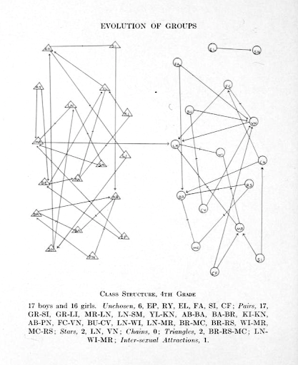
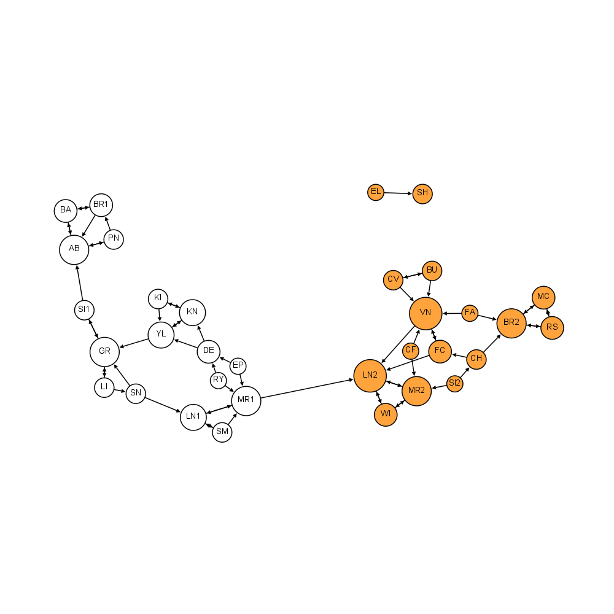

```{r setup, include=FALSE}
knitr::opts_chunk$set(echo = TRUE)

if (!require(igraph)) {
    install.packages("igraph", repos="http://cran.uk.r-project.org")
}

if (!require(snahelper)) {
    install.packages("snahelper",
                     repos="http://cran.uk.r-project.org")
}
# if (!require(intergraph)) {
#     install.packages("intergraph", repos="http://cran.uk.r-project.org")
# }
# if (!require(ggnetwork)) {
#     install.packages("ggnetwork", repos="http://cran.uk.r-project.org")
# }
```

# (Social) Network Data

Today we're going to demonstrate simple ways of loading network data, visualisation, analysing structure, and showing how this can help answer research questions. 

So a recurring point I'll make today is that there are lots of systems that can be represented as a network. Perhaps you're interested in **social** networks like twitter [@murthySociologicalUnderstandingSocial2012], but there are other types of networks that could be of interest [@teroRulesBiologicallyInspired2010]:

<iframe width="560" height="315" src="https://www.youtube.com/embed/HyzT5b0tNtk" frameborder="0" allow="accelerometer; encrypted-media; gyroscope; picture-in-picture" allowfullscreen></iframe>

## What is a Network?

A network is a way of representing how things are connected (or not). They can be social (who tweets to who), economic (which companies employ which people), engineering (which parts were used in each product) etc. The representing of these connetions is a network--also call a [graph](https://en.wikipedia.org/wiki/Graph_(discrete_mathematics)) in mathematics, (confusing eh?)--and in the social sciences it's a tool, often applied to help quantiatively (and sometimes qualitatively) answer research questions [@heathChasingShadowsDefining2009]. 

## Installing `R` and `igraph`

We're going to focus on the `igraph` `R` package today. There are [*many* other options](#na-packages) but `igraph` is a fairly comprehensive package for getting started. If you're looking to go beyond what we cover today, I recommend looking through the `igraph` documentation for your particular interests before trying the other packages, and feel free to email me [griffith.rees@sheffield.ac.uk](mailto:griffith.rees@sheffield.ac.uk) if you've got questions. Please ask *detailed* questions, demonstrating what you're trying to do and what you've tried so far so I can efficiently reply.

<!--Survey: Who's used R before?-->

<!--Survey: Who has a working R install?-->

<!--Survey: Who has a working igraph install? Let's just make sure that works for everyone.-->

For those that have got `igraph` installed feel free to continue further down this handout to play around with the data.

Everyone else: please download `RStudio` from <https://rstudio.com/products/rstudio/download/#download>.

It should fit your operating system automatically (Windows, Linux or Mac). If you're not seeing an option (possibly old versions of Windows, macOS, or unusual Linux distributions) message me. ^[Even if you're in a broader *nix category there are [options...](https://www.freshports.org/devel/RStudio/)]

<!--Survey: Finished installing R-->
Please fill in the survey when you're done or post messages if you're having issues.

Now let's install <https://igraph.org/r/>

```{r, eval=FALSE}
install.packages("igraph")
```

and then load it in your `R` session.

```{r, eval=FALSE}
library(igraph)
```

<!--Survey of people having completed this.-->

## Test loading `igraph` data

We're going to jump into visualisation with `igraph` as a test of the install and a demonstration of visualisation options. Then we'll break it down into what's going on underneath but again, feel free to mess around with what's loaded as we continue on.

We begin by loading node and edge data from [Dr Evelina Gabašová's](Dr Evelina Gabašová's) excellent dataset on [which characters appeared together in scenes of Star Wars films](http://evelinag.com/blog/2015/12-15-star-wars-social-network/). Shamlessly borrowing from an NYU [short course](https://github.com/pablobarbera/data-science-workshop/tree/master/sna) created by [Dr Pablo Barberá's](http://pablobarbera.com/) we focus on Episode IV - *A New Hope*.

You can have a look at my github repository for this course: <https://github.com/griff-rees/network-analysis-course> and download the repository. That includes the code for this handout and the data we're playing around with today.

Once you've downloaded and unzipped and have a look in the data folder to make sure there are 4 csv files, including `star-wars-network-edges.csv`  and `star-wars-network-nodes.csv` The originals can be found at <https://github.com/pablobarbera/data-science-workshop/tree/master/sna/data>.

<!--
Please download these datafiles:

* <https://github.com/pablobarbera/data-science-workshop/raw/master/sna/data/star-wars-network-edges.csv>
* <https://github.com/pablobarbera/data-science-workshop/raw/master/sna/data/star-wars-network-nodes.csv>
  -->

### Load Node/Edge CSVs {#load-csvs}

<!--In this dataset, nodes are characters in the film and edges are the number of scenes they appear in together.-->

First load the csv of nodes and have it print out the list of records.
```{r}
nodes <- read.csv("data/star-wars-network-nodes.csv")
nodes
```
You should see two columns: list of character names from the film alongside a list of id numbers. We'll look at this in detail later.

* name (character names)
* id (integer)


Next load a list of edges:
```{r}
edges <- read.csv("data/star-wars-network-edges.csv")
edges
```

Again we'll go into this in further detail but for now it's just good to know everyone's got these up and working. You should see three columns:

* source (a character's name)
* target (another character's name)
* weight (an integer for the nuber of scenes they share)

There are many ways of storing network information, and we'll look at other options later. For now: note the nodes are the names of characters and the edges are pairs of characters followed by the number of scenes they share in the film.

### Creating a network

```{r}
g <- graph_from_data_frame(d=edges, vertices=nodes, directed=FALSE)
```

We'll look at how this works in detail in the next section, but note here that we load the `data.frame` of edges into the `d` parameter and the `data.frame` of nodes (in this characters) as vertices (another name for nodes in network analysis). We're setting `directed=FALSE` for simplicity (more on this later).

### Visualising a network

There are lots of ways to visualise networks. In part as a test of setup, we're jumping in to demonstrate how visualisation works, make sure everything's installed correctly and ensure the data is loading correctly as well.

```{r}
plot(g)
```

Mostly illegible eh? Your plot will have a different layout but as long as it looks similar we should be ready to go.

<!--Survey of this working for people.-->

Even with this rough layout we can, however, answer a research question:

Which character shares the *least* number of scenes with any other?

<center>

{width=15%} {width=15%} {width=15%} {width=15%} {width=15%}
<!--Survey of character who shares the least number of scenes between R2-D2, GREEDO, JABBA, Leia and GOLD FIVE.-->

</center>

Sneak preview of what's to come:

```{r, fig.width=12, fig.height=7, echo=FALSE}
# Prepare colour attributes
h <- g
dark_side <- c("DARTH VADER", "MOTTI", "TARKIN")
light_side <- c("R2-D2", "CHEWBACCA", "C-3PO", "LUKE", "CAMIE", "BIGGS",
                "LEIA", "BERU", "OWEN", "OBI-WAN", "HAN", "DODONNA",
                "GOLD LEADER", "WEDGE", "RED LEADER", "RED TEN", "GOLD FIVE")
neutral <- c("GREEDO", "JABBA")

# Add the color attribute to the network nodes
V(h)$color <- NA
V(h)$color[V(h)$name %in% dark_side] <- "red"
V(h)$color[V(h)$name %in% light_side] <- "gold"
V(h)$color[V(h)$name %in% neutral] <- "green"

plot(h, layout=layout_with_fr, main="Force-directed")
legend(x=.75, y=.75, legend=c("Dark side", "Light side", "Neutral"), 
       pch=21, pt.bg=c("red", "gold", "green"), pt.cex=2, bty="n")
```

# Networks (aka Graphs)

Now that we've got the basic package and a dataset up let's dive into the details of what's going on here. The goal is to give you enough of a foundation on network analysis to see how it can help answer research questions. It's also worth mentioned that in mathematics networks are often called graphs, and fit under the umbrella term [graph theory](https://en.wikipedia.org/wiki/Graph_theory) hence the package name `igraph`. I'll use the terms *graph* and *network* interchangeably, while a visualisation of a network I'll try to call a plot (apologies in advance if I call a visualisation a graph!).

The basic components of networks aka graphs are *nodes* and *edges*.

## Nodes

In the dataset we're using, Star Wars characters are *nodes*, also know as a *vertices* (or *vertex* if singular). This is analogous to records in classic datasets like people or firms, which can include characteristics such as age or income. Nodes can have different characteristics too--usually called node attributes--and these can help in analysing and understanding the network.

### Node Attributes

Let's take a deeper look at the data we used to create the plot above:

```{r, eval=FALSE}
nodes
```

As mentioned in a [previous section](#load-CSVs) there are two components of data for each of these nodes:

* name (character names)
* id (integer)

To see how that shows up when loaded into an `igraph` network use the `V` (vertices, synonymous with nodes) function:

```{r}
V(g)
```

This lists the vertices/nodes, the id it holds in memory and how many there are. The `name` attribute is particularly helpful in graph visualisation as it shows up automatically with `igraph` plots. If you've not used `R` before, here's a useful way to look at parts of data (usually columns in a table) using the `$` symbol after the variable name, followed by the column name (like in the `nodes` variable) or the attribute name (like in the `g` network variable).

```{r, eval=FALSE}
nodes$name
V(g)$name
```

We also get a list of all attributes with

```{r}
vertex_attr(g)
```

### Adding Attributes

Let's add another attribute. Following the classic notion of the force in start wars we can add data indicating which side of the *force* characters are associated with (or othe if neighther). First we create vectors of names using the `c` (combine) function to get a vector of strings (names of nodes in this case).

```{r}
# Create 
dark_side <- c("DARTH VADER", "MOTTI", "TARKIN")
light_side <- c("R2-D2", "CHEWBACCA", "C-3PO", "LUKE", "CAMIE", "BIGGS",
                "LEIA", "BERU", "OWEN", "OBI-WAN", "HAN", "DODONNA",
                "GOLD LEADER", "WEDGE", "RED LEADER", "RED TEN", "GOLD FIVE")
neutral <- c("GREEDO", "JABBA")
```
Now we can add colours to the `nodes` based on the vectors of names we just created. `R` has a set of [colour names that can be used in plots](http://www.guianaplants.stir.ac.uk/seminar/materials/colorPaletteCheatsheet.pdf), feel free to pick your own. By storing one of these colour names in the new `color` attribute, we can have that directly show up in the visualisation. Note the spelling of `color`: if you add to a `colour` coloumn the data is stored but may not automatically affect the plot.

To add the color attribute, first create the column with an `NA` (refers to 'not available') value

```{r}
# Add the color attribute to the network nodes
V(g)$color <- NA  # Initialse the new 'color' attribute as NA for all nodes
```

then fill it up using the categories saved above. If you also run `V(h)$color` in between adding these you'll see the how the `$color` column gets populated

```{r}
V(g)$color[V(g)$name %in% dark_side] <- "red" # set the dark side color name to red
V(g)$color
```

To break this down: the `%in%` operation tests if data in one column---in this case the `$name` variable which is to the *left* of `%in%`---matches with (*is in*) the options on the *right* of the `%in%`. Where it does match it returns `TRUE`, and elsewhere it returns `FALSE`.

```{r}
V(g)$color[V(g)$name %in% light_side] <- "gold" # set the light side color name to gold
V(g)$color[V(g)$name %in% neutral] <- "green" # set the color of neutral characters to green
V(g)$color
```

In this case that means the colour value intended gets saved in places where they match the dark, light and neural sides. It's complicated to explain but extremely useful.

### Subgraphs

These attributes can help us look at *subgraphs*: portions of the graph such as just the `dark_side`:

```{r}
dark_side_graph <- induced_subgraph(g, dark_side) # Using the dark_side variable from above
V(dark_side_graph)
```

This raises an important point: so many aspects of the world can be thought of as a network, and just as populations are sampled to make summary claims---such as income distribution or age---networks are often sampled for analysis. And just as we need to up front about sampling methods in many research contexts, we need to be aware that often there are portions of networks we cannot observe. Those sections may be very important, and in failing to observe them we can end up with very different structures and very different results.

In the classic sense of probability theory the [law of large numbers](https://en.wikipedia.org/wiki/Law_of_large_numbers) suggests that often 1000 trials of an experiment, or random sampling from a population (often needing weighting to be accurate), can lead to representative results for the whole population. This can unfortunately be very difficult to manage in the case of networks [@browneSnowballSamplingUsing2005].

So: often quantitaive analysis of networks involves subgraphs, and it's worth being aware of that when analysing. Keep that in mind: we'll come back to this.

<!-- Mention episode 1...?-->

### Visualising

It's worth acknowledging that we're focusing on specific attributes that help with visualisation. I got frustrated perparing some of these slides because I tried doing something like this but with variations in spelling...

<!--Survey on confusion between British and American spelling-->
<!--Survey on British and American meaning of biscuit-->

```{r}
# load the data to a new variable (f) in the same way we loaded for g prior to adding colour
f <- graph_from_data_frame(d=edges, vertices=nodes, directed=FALSE)

# Add a colour attribute which using the British rather than American spelling...
V(f)$colour <- NA  # Initialse the new 'colour' attribute as NA for all nodes
V(f)$colour[V(f)$name %in% dark_side] <- "red" # set the dark side colour name to red
V(f)$colour[V(f)$name %in% light_side] <- "gold" # set the light side colour name to gold
V(f)$colour[V(f)$name %in% neutral] <- "green" # set the colour of neutral characters to green
plot(f)
```

Notice no difference in colour. Now compare that with 

```{r}
plot(g)
```

This should illustrate two things: 

* You can add lots of attributes to nodes in a way similar to adding a column of data to a normal `data.frame` like the `nodes` variable
* Some attributes can have a special role in particular network packages, such as `color` in `igraph`

Similarly: you can visualise specific sections of a graph, and that can be helpful in providing better detail/easier to read. Returning to the `dark_side_graph` subsample 

```{r}
plot(dark_side_graph)
```

This is a lot easier to read and can, as a way of zooming in, give us a clearer picture of some aspects of the structure. This becomes more crucial with much larger network datasets. It's already difficult to read the names of characters in these plots. Let's compare it with the other side of the force:

```{r}
light_side_graph <- induced_subgraph(g, light_side) # Using the light_side variable
plot(light_side_graph)
```

Interesting and detailed by itself, but again worth being aware that it can make a significant difference comparing this with the rest of the network, and potentially misleading without acknowledging the network it's sampled from.

Like many other quantitative methodologies there are many other types of attributes that we can apply to nodes such as

* Numerical (age, body mass index, income)
* Boolean (yes/no, sex, citizenship <!-- mention I wasn't born with British citizenship-->, neutral)
* Categorical (ethnicity, class, nationality, sector, color as combination of side of the force or neutral)
* Spatial (geographic position, location in hospitals)

We'll return to the applicablity of these later but generally: most variables that can be used in classic statistical analysis can be applied in network analysis. It might be hard... but that data can generally be useful. 

To close: *be wary of sampling issues in network analysis!*
<!-- Ask for general feelings/survey for break -->

## Edges

Edges, also called links and ties, are the connections in networks/graphs. They can be friendship, kinship, contracts, following, liking, debt, etc. Our conversation right now is via a digital network, but if we were in a lab there would be conversations face to face, just with a lot more physical movement and scribbling on a white board.

### Edge Data

To get started let's look at the second data file we loaded in the beginning

```{r}
head(edges)
```

The `head` and `tail` functions are very handy ways to peak at datasets, especially very large ones. By default they return 6 records from the start or end of a `data.frame` respectively.

`edges` has three variables, the first two of which specify edges and the last is an attribute. We'll look at these in turn

#### Directed or Undirected

Edges can be categorised as directed or undericted. So far, we've been working with an undirected graph, and that's why we include the `directed=FALSE` parameter in creating `g`: `g <- graph_from_data_frame(d=edges, vertices=nodes, directed=FALSE)`.

But it's no accident that the first two column names of the edges file are `source` and `target`. Different network packages follow different conventions (see the [appendix](#na-packages) for other packages) but directional information can be very important in networks. Someone can like someone else's tweet, just as one company can offer a contract to another or academic papers (hopefully) get cited by in other papers. It's important in these cases to specify where the direction of the connection comes from, and some of the first social network analysis research (then called sociograms [@festingerWhoShallSurvive1954]) use directional infromation:

<center>



</center>

In this study, people were individually asked to name friends at school. This diagram of friendship in a 4th grade class (US term for UK year 5) in the 1930s is a famous demonstration of a case where friendship is highly correlated with gender. If you look closesly (try `ctrl/cmd +` to zoom in) you'll see arrows pointing at circles such as from `EL` to `SH` while in a few other cases like the connection between `BR` and `MC` there are no arrows.

This means that `EL` named `SH` as a friend but `SH` didn't reciprocate (also name `EL` as a friend), while `BR` and `MC` both named each other as friends.

Here's a newer diagram of the same network which is a bit easier to read from <http://www.martingrandjean.ch/social-network-analysis-visualization-morenos-sociograms-revisited/>:

<center>



</center>

With the additional information of the shapes in the first digram, which map to colours in the second, this is a way of demonstrating the separation of social groups by gender and also how those groups are very *weakly* tied together. Weakness in as much as only one connection is named across gender and it is not reciprocated. There are ways of quantifying how different groups are connected in networks which is outside the scope of the session today (though there's a bit later...), but there is lots of research on this in many other types network analysis including social [@leskovecEmpiricalComparisonAlgorithms2010].

To summarise: undirected networks have two basic states between nodes

**Undirected Networks**

* Connected (a is linked to b) formalised as $$a \ue b$$
* Unconnected (a is not linked to b) formalised as $$a \ne b$$

while directed networks have 3 basic states between nodes

**Directed Networks**

* Unidirectional (connection from a to b) formalised as $$a \de b$$
* Bidirectional (connections from a to b and b to a) formalised as $$ a \leftrightarrow b $$
* Unconnected (a is not linked to b) formalised as above $$a \ne b$$

And returning to the way we constructed `g` originally:

```{r}
g <- graph_from_data_frame(d=edges, vertices=nodes, directed=FALSE)
```

we can also construct that network as directed by leaving out `directed=FALSE` because the default value is `directed=TRUE` 

```{r}
d <- graph_from_data_frame(d=edges, vertices=nodes, directed=TRUE)
plot(d)
```

and just to help you remember, this is equivalent to the default state without including the directed parameter (I've forgotten this myself many times)

```{r}
d <- graph_from_data_frame(d=edges, vertices=nodes)
plot(d)
```

#### Edge Attributes

Just like nodes, edges can have attributes. The directionality in the previous section is an example of information associated with a tie, and the presence or absence of one. One of the most common examples of tie attributes is included in the Star Wars dataset, and is usually described as a *weighted tie*. This is the third column in `edges` labeled `weight`

```{r}
head(edges)
```

This is the number of scenes that both characters share in the film. If combined with the `source` and `target` information then it's a means of weighting directed ties/edges.

With all this in mind, we can look at the original Star Wars network for a glimpse of what's included in the whole structure:

```{r}
g
```

It's a bit technical but what shown is a summary of the network object:

* `U` means undirected  
* `N` means named graph (hence the names attribute)
* `W` means weighted graph (hence the weight attribute)
* `22` is the number of nodes  
* `60` is the number of edges  
* `name (v/c)` means _name_ is a node attribute and it's a character (aka a string, or list of characters)
* `weight (e/n)` means _weight_ is an edge attribute and it's numeric  

The rows are indicating connections between nodes so record `[1]` is between `R2-D2` and `C-3PO`. Also note for those of you used to `python`: `R` is 1 indexed rather than 0 indexed...

Similar to the vertices `V()` function there is an edge function `E()` which prints the connections section of the summary of `g` just described.

```{r}
E(g)
```

Also in similarity to nodes, edge attributes are accessed by `$`:

```{r}
E(g)$weight
```

and the list of attributes is printed by the `edge_attr` function

```{r}
edge_attr(g)
```

I realise this is going very quickly but the point is to demonstrate how similar accessing edge attribute information is to accessing node attributes. 

With this demonstrated, we can now try adding another edge attribute. This is trickier than adding node attributes because there are so many edges (and this gets more complicated depending on whether directed or undirected) but similar to the method we used before:

```{r}
E(g)$color <- "blue"
E(g)$color[E(g)$weight >= 5] <- "red"
```

This is a very simple case where we're colouring edges based on weight, once again using the standard colour names that come with `R`. We've set the color criteria to be for edges of greater weight than five (of which there are very few).

One again using the `edge_attr` function we can see what's been added:

```{r}
edge_attr(g)
```

And similar to node attributes, color has the extra significance of automatically being added to plots (though as this is few edges it might not show up obviously on your screen).

```{f}
plot(g)
```

Hope it's clear on some screens. We've obviously got issues with positioning which is to come. We're very close to finishing the edge section. We've got one more part to cover then on to the details of visualisation.

But before we do, once again we can use this visualisation (and the weight attribute to answer a question): which pair of characters share the most scenes in Star Wars IV?

<!-- break/survey -->

#### Adjacency Matrix

So far the edges have all been via lists of pairs of node names, but other ways of representing edges is via a matrix, and that features a lot in other network packages. I'm just going to briefly show you that now

```{r}
g[]
```

For those of you interested in the details, the matrix is symmetrical if undirected and potentially asymetrical if directed. Each row and column are lists of connections between one node and all the others (including itself, which is the diagonal down the middle). I'm going to leave that there for today but just to give you some idea of where that comes from and what that means if you see a package asking for an ajacency matrix.

As an exercise: spot the differences to the directed ajacency matrix:

```{r}
d[]
```

Note: there aren't any cases of links to oneself in the Star Wars example (which wouldn't make sense in a film... except for maybe a sci-fi time travel one) but in other cases that can be applicable, such as emailing oneself (something I do all the time as reminders).

## Visualisation

Finally down to visualisation! We've obviously spent almost all this time on constructing the graph and understanding the data that composes it. But what's really annoying throughout (and generally a very hard problem, for which there are many packages) is a good visual presentation of a network. There's lots of work on this but to just give you a taste we're going to dive into the `plot` function and the `layout` parameter, keeping the endge highlighting we've been working on

### Basic Layout options
```{r, fig.width=12, fig.height=7}
par(mfrow=c(2, 3), mar=c(0,0,1,0))
plot(g, layout=layout_randomly, main="Random")
plot(g, layout=layout_in_circle, main="Circle")
plot(g, layout=layout_as_star, main="Star")
plot(g, layout=layout_as_tree, main="Tree")
plot(g, layout=layout_on_grid, main="Grid")
plot(g, layout=layout_with_fr, main="Force-directed")
```

These are just some of the layout options to choose from. The `layout_with_fr` is a favorite of many, so that's what I used at the start. So to get closer to what I showed at the statrt:

```{r}
plot(g, layout=layout_with_fr, main="Force-directed")
```

Note that the size of the plot for the grid was specified, but for the inidividual example I've left it blank (default). The plot is entirely based on a random number generator, so everyone's will look a bit different. We can reproduce the same arrangement by specifying a seed (coming up below).

### Layout with node colouring and specific seed

Bringing the node colouring back in, we can make the most of node and edge attributes.

```{r, fig.width=12, fig.height=7}
V(g)$color <- NA
V(g)$color[V(h)$name %in% dark_side] <- "red"
V(g)$color[V(h)$name %in% light_side] <- "gold"
V(g)$color[V(h)$name %in% neutral] <- "green"
par(mfrow=c(2, 3), mar=c(0,0,1,0))
plot(g, layout=layout_randomly, main="Random")
plot(g, layout=layout_in_circle, main="Circle")
plot(g, layout=layout_as_star, main="Star")
plot(g, layout=layout_as_tree, main="Tree")
plot(g, layout=layout_on_grid, main="Grid")
plot(g, layout=layout_with_fr, main="Force-directed")
```

```{r, fig.width=12, fig.height=7}
set.seed(3339)  # Speficy a seed for reproducing network layout

plot(g, layout=layout_with_fr, main="Force-directed")
legend(x=.75, y=.75, legend=c("Dark side", "Light side", "Neutral"), 
       pch=21, pt.bg=c("red", "gold", "green"), pt.cex=2, bty="n")
```

Here we've now specified the `set.seed(3339)` command, which means that the random number generator *should* produce the same results on your screen. 

### Interactive layout

But: should we just keep trying different numbers until it looks good? That's a really annoying problem, and a reason why there are many options for visualising networks. `igraph` has a basic option to help with this but it can be difficult to set up and at the moment it's more likely to work on windows and linux than macOS. There is a workaround for macOS: <https://github.com/sethrfore/homebrew-r-srf> but now's not the time to try.

```{r, eval=FALSE}
set.seed(3339)  # Speficy a seed for reproducing network layout

tkplot(g, )
legend(x=.75, y=.75, legend=c("Dark side", "Light side", "Neutral"), 
       pch=21, pt.bg=c("red", "gold", "green"), pt.cex=2, bty="n")
```

`snahelper` (included in this above) is another very new option (apologies for the lack of warning). It's a collection of tools which seem to work accross platforms and provide sophisticated options for altering graphs interactively.

```{r, eval=FALSE}
library(snahelper)
SNAhelperGadget(g)
```

Other other options include 

* `ggnetwork`: `R` package for use with `ggplot`, related to `snahelper`
* `gephi`: a standalone package for interactive arrangements <https://gephi.org/>

<!-- add another poll question here on the visualisation-->

# Lab 1

We've covered loading and basic visualisation of network data. To see how it works on data that might be closer to research you're interested in we're going to run a workshop with another, more _real world_ dataset from twitter.

In the folder with the Star Wars data you should see two data files called `congress-twitter-network-edges.csv` and `congress-twitter-network-nodes.csv`.

Your task, should you choose to accept it, is to load these datafiles, visualise them, and have a go at answering a research question. Hint: may the *force* plot be with you.

<!-- some hints-->

# Basic Network Analysis

So far, all we've done is look at visualising networks, which is a form of analysis hence the research questions we considered, but it has many ideosyncracies and can easily be customised in ways that may be very helpful to one interpretation of results, but that can also be very misleading. Further, network analysis as a whole has often led to a lot of arguments in more rigorous analysis and interpretation.

## Example of debates on results

If any of you saw my taster session, this might be familiar. For the rest: this is a video of a presentation around a very highly cited network analysis study assessing the social contagiousness of behaviour that leads to obesity. Note this involves another dimension we haven't discussed which is unfortunately quite complex in network analysis: change over time.

### Too impressive to be correct?

<iframe width="560" height="315" src="http://www.youtube.com/embed/8aEtyRD1j5U?rel=0" frameborder="0" allowfullscreen></iframe>

### There's been a lot of criticism[^1]...

- *Homophily and Contagion Are Generically Confounded in Observational Social Network Studies* [@shaliziHomophilyContagionAre2011]
- *The “unfriending” problem: The consequences of homophily in friendship retention for causal estimates of social influence* [@noelUnfriendingProblemConsequences2011]
- *Is obesity contagious? Social networks vs. environmental factors in the obesity epidemic* [@cohen-coleObesityContagiousSocial2008]
- *The spread of obesity in a large social network over 32 years* [@merckenDynamicsAdolescentFriendship2010][^2]
- **... and a reply**: Christakis & Fowler [-@christakisSocialContagionTheory2013]

[^1]: See <https://statmodeling.stat.columbia.edu/2011/06/10/christakis-fowl/> for some summary
[^2]: Full disclosure: one of my examiners was a co-author on one of these papers...

So it's worth once more bearing in mind that network analysis is hard, and there are issues with methods, application and interpretability. But: keeping that in mind, we shall endeavor.

## Summary (Marco-ish)

We'll start with analyses that summarise the network structure. It's helpful to get an overview before drilling down to specific sections of a network. The differences between *undirected* and *directed* networks feature heavily and I'll try to cover that throughout. This is very quick and meant as hints of how this can be useful. 

<!--
### Size

The size of a network is usaully in reference to the number of *edges* rather than the number of *nodes* but this can vary. I've found this confusing in the past, and it's slightly more confusing when you're differentiating between directed and undericted networks.

#### Directed

I generally start with the undirected examples below, but here it's easier to start with a directed network

```{r}
gsize(d)
```

this is simply the number of edges. Seems straightforward, but remember the adjacency matrix is *asymetric*...

#### Undirected

Undirected networks *by definition* map to *symmetric* adjacency matrices, and so the maximum number of edges is half the number of nodes. So: the definition of an undirected network is half the number of edges

```{r}
gsize(g)
```
-->

### Density

One of the first and most straight forward components of quantitative assessment is density. Density is a measure of how many connections there are between nodes divided to how many *possible* connections. It's often just called network density, but the `igraph` method is `edge_density` to highlight that it's specific to edges.

```{r}
edge_density(g)
```

note that the combinatorics of directed networks are (normally) *twice* that of undirected networks

```{r}
edge_density(d)
```
<!-- mention difference of subgraphs and how this consideres disconnected nodes and that it's half of the directed example-->

### Number of components

A component is a portion of a network, often referred to as a subgraph but sometimes is a short hand for the *largest connected component*. These are ways of looking at and assessing separate (because of no ties) parts of a network.

#### Connected Components

The first thing to consider in these cases is whether the network is connected, meaning that every node has at least one directed edge to another. 

```{r}
is_connected(g)
```

This is applicable irrespective of whether the network is directed. In this case we have one node with no edges so we have two components.

```{r}
V(g)
components(g)
```

`$no` indicates the number of components, `$csize` is the size of these components and `$membership` lists which components each node is in. Note: this isn't a count of components, nodes can only be in 1. `GOLD FIVE` is in component 2, not 2 components.

These results are fine for *undericted networks* but for *directed networks* things are (as ever) more complicated:

#### Weak connectivity in directed networks

Weak connect meanse that there is at least one path from any node in a component to any other in that component, even if it doesn't follow the same *direction*. So if we have $a \de b; c \de b$ but not $c \de a$ then there  is 1 connected. 

```{r}
connectivity_example <- graph(c("a", "b", "c", "b"))
components(connectivity_example)
```

This is the same as the undirected example

```{r}
V(d)
components(d)
```

#### Strong connectivity in directed networks

Strong connectivity includes the directionality of connections, so if a directed path _doesn't_ exist between a pair of nodes then they aren't considered connected. Returning to the example above: 

```{r}
components(connectivity_example, mode = "strong")
```

but if we make one of the connections bidirectional ($b \leftrightarrow a$), then we have one fewer component

```{r}
connectivity_example <- add_edges(connectivity_example, c("b", "a"))
components(connectivity_example, mode = "strong")
```
The directed Star Wars network:

```{r}
components(d, mode = "strong")
```
#### Extract components

Just as a basic example (feel free to extrapolate many options) you can also extract components as separate graph objects. This was demonstrated above with the `induced_subgraph` command, but for that we had to specify sections of the network that would be less convenient than the `decompose` function

```{r}
decompose(d)
```

We'll come back to this later.

### Diameter

Diameter is the longest shortest path (confusing eh?). To unpack: find the shortest paths between every pair of nodes within the same component and then find the maximum of those shortest paths. Once again undirected vs directed makes a difference.

#### Unweighted

For ease of demonstration we will avoid the default which includes weights, first undirected:

```{r}
diameter(g, weights=NA)  # Weights are included by default, more later
get_diameter(g, weights=NA)
farthest_vertices(g, weights=NA)
```

and then directed:

```{r}
diameter(d, weights=NA)
get_diameter(d, weights=NA)
farthest_vertices(d, weights=NA)
```

#### Weighted

By default, if edges are weighted then that is included in distance measures and can lead to different results, once again varying between undirected

```{r}
diameter(g)  # Weights are included by default
get_diameter(g)
farthest_vertices(g)
```

and directed

```{r}
diameter(d)
get_diameter(d)
farthest_vertices(d)
```

<!--
### Reciprocity (cue Lauryn Hill's *Ex-Factor*)

Reciprocity is the ratio of cases where ties are reciprocated and is generally inapplicable to undirected networks because those ties are effectively all reciprocated.

#### When reciprocity is 0 or 1 (min or max)

```{r}
is_directed(d)
reciprocity(d)
is_directed(g)
reciprocity(g)
```

0 for the directed and 1 for the undirected? Weird eh? By definition all ties in an undirected network are analogous to bidirectional ties, so by definition the ratio is 100% (1). But why doesn't this work for the directed example? This is because of that pesky *isolated* node, which means that if there are multiple *connected components* then by definition the result is 0. 
#### Old or _traditional_ ratio reciprocity

To illustrate this more easily let's return to the simple 3 node example above:

```{r}
reciprocity(connectivity_example, mode="ratio")
E(connectivity_example)
```

Now we've got a value between 0 and 1, which is the proportion of ties that are reciprocated. Those are cases where entity $a$ is bidirectionally connected to entity $b$

$$a \leftrightarrow b$$
that is a reciprical tie. But the other tie is not reciprocal
$$c \de b$$

so the ratio is $1:2$. This isn't the default option though, which we'll get to later.

Note this still doesn't solve the components issue:

```{r}
reciprocity(d, mode="ratio") 
```

because the traditional model adheres to the definitions of 1 and 0 listed above. We need to look at a connected component (in this case the largest connected component).

#### Old ratio of largest connected component

The default metric is complicated so it's easiest to stick with the `ratio` option to demonstrate the use of the `decompose` command to see the list of connected components. 

```{r}
decompose(d)
```

there are more options for decompose, but to focus on the largest we index (staring from 1, rather than `python` starting from 0)

```{r}
decompose(d)[[1]]
reciprocity(decompose(d)[[1]], mode="ratio")
```


<!-- question on comparison between measures -->
<!-- It's worth being careful deciding which one(s) you use and justifying that choice in your research.

#### Default method of largest component

I've avoided the mathematics thus far given the complexity of covering all this material, and I'm afraid it would take some time to explain this so I'm just going to present the equation here for reference. 

This is the default method in `igraph` and arguably most broadly applicable method for calculating centrality [@garlaschelliPatternsLinkReciprocity2004].

-->
<!-- ## Bipartite-->

<!--- def need break -->

## Node Properties (Micro-ish)

Again, we're racing through a lot of things so there's much more to ideally cover, but we'll finish with a set of analysis options at node rather than graph level. Many of these will also assume a connected component to make useful relative comparisons.

### Degree

Degree in a network context is how many edges a node has. Once again the undirected vs directed variation is important. Given this is an individual level calculation we have to choose a node or a set of nodes. We can begin with a degree distribution to get a flavour of what's worth focusing on

#### Undirected and default directed

The degree command for the undirected network will return the number of edges each node has by default. You can add a `normalized` parameter to indicate it as a proportion of the total degrees.
```{r}
degree(g)
degree(g, normalized = TRUE)
```

You can also add this to a `size` attribute on each node to incorporate that into the plot

```{r, fig.width=12, fig.height=7}
set.seed(3339)

V(g)$size <- degree(g)

plot(g, layout=layout_with_fr, main="Force-directed")
legend(x=.75, y=.75, legend=c("Dark side", "Light side", "Neutral"), 
       pch=21, pt.bg=c("red", "gold", "green"), pt.cex=2, bty="n")
```

Directed graphs use the `mode = 'all'` by default so size of the nodes ends up being the same as the undirected example. 

```{r}
degree(d, mode = "all") # All is the default, but for clairty
```

```{r, fig.width=12, fig.height=7}
set.seed(3339)
V(d)$size <- degree(g, mode = "all")

plot(d, layout=layout_with_fr, main="Force-directed")
legend(x=.75, y=.75, legend=c("Dark side", "Light side", "Neutral"), 
       pch=21, pt.bg=c("red", "gold", "green"), pt.cex=2, bty="n")
```
But there are variations...

#### Directed In Degree

The in degree is the number of cases where a node is recieving a connection 

```{r}
degree(d, mode = "in")
```


so `R2-D2` has pretty much all his edges recieved while `CHEWBACCA` has arguably more extrovert.

#### Directed Out Degree

The out degree is the number of cases where a node is source of a connection 

```{r}
degree(d, mode = "out")
```

Hence `R2-D2` on 0 (seems to get all the attention, but not reciprocate) while `CHEWBACCA`'s focus is on others... awww. 

### Centrality

Last individual level thing we can cover today is centrality, of which, like everything else I've shown there are many variations. I won't go into this too much due to time but it's a very active area of research, especially in the hard sciences. Degree and it's variations is actually an example of this.

#### Closeness

This is the inverse of the shortest path between nodes and incorporates weights by default. The default focus is on received connections (`in` in the previous examples). Note the warnings, it's worth separating into connected components to avoid the shift from `GOLD FIVE`

```{r}
closeness(d, mode = "out")
closeness(d, mode="in")
closeness(d, mode="all")
```

#### Betweeness

This is a way of looking at connections with a focus on individuals roles in the structure. Think back to the sociogram example: that one weak tie connected across genders, and while it's not strong like closeness, it's really important to the overall structure.

```{r}
betweenness(g)
betweenness(d)
```

### PageRank
Last flavour: this was the core example underlying Google's *initial* algorithm of structure in links between websites.

```{r}
page_rank(g)
page_rank(d)
```


<!--## Visualisation -->

# Lab 2

Take what we've covered and apply it to the twitter dataset. 

# What else?

## There's lots (just a taster)

- Negative ties (few studies but a recent [*Social Networks* special issue](https://www.sciencedirect.com/journal/social-networks/vol/60))
- [Erdős–Bacon number](https://en.wikipedia.org/wiki/Erd%C5%91s%E2%80%93Bacon_number)

## Useful links

* Most of this comes from/is inspired by Katherine Ognyanova's
  + [**Brilliant** visualisation guide](http://www.kateto.net/wp-content/uploads/2019/06/Sunbelt%202019%20R%20Network%20Visualization%20Workshop.pdf) 
  + Excellent github repo <https://github.com/kateto/R-Network-Visualization-Workshop>
* A bunch of useful links to papers/software etc. <https://github.com/briatte/awesome-network-analysis>
  
*Thanks!*

<!--## Another network time series...
{ width=60% } -->
# Appendices

## Network Analysis Packages {#na-packages}

* R
    + [iGraph](https://igraph.org/r/) built on a C++ library, easier to get started and pre-dates ggplot so provides it's own visualisation options
    + [statnet](http://statnet.org/) focused particularly on [exponential random graphs (ERG) models](https://en.wikipedia.org/wiki/Exponential_random_graph_models), maintained by [Prof Carter T. Butts](https://scholar.google.co.uk/citations?user=-VGAs1cAAAAJ&hl=en)
    + [ggraph](https://ggraph.data-imaginist.com/) network visualisation in a way similar to [ggplot](https://ggplot2.tidyverse.org/reference/ggplot.html), maintained by [Thomas D Pedersen](https://www.data-imaginist.com/)
    + [Rsiena](https://www.stats.ox.ac.uk/~snijders/siena/) Actor-oriented logitudinal models (ERG), created by [Tom Snijders](https://cran.r-project.org/web/packages/RSiena/index.html)
* Python (my language of choice)
    + [networkx](https://networkx.github.io/) very established, not very fast for large datasets but very flexible (my package of choice for testing ideas)
    + [igraph](https://igraph.org/python/) Effectively the same as the R package (both use the same underlying C++ library)
    + [graph-tool](https://graph-tool.skewed.de/) Much newer, very speed efficient (also C++ underneath)
* Windows
    + [UCINET](https://sites.google.com/site/ucinetsoftware/home) windows, developed and maintaied by (people including head of group at Manchester)

## References
